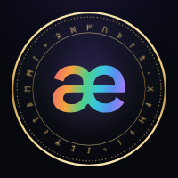
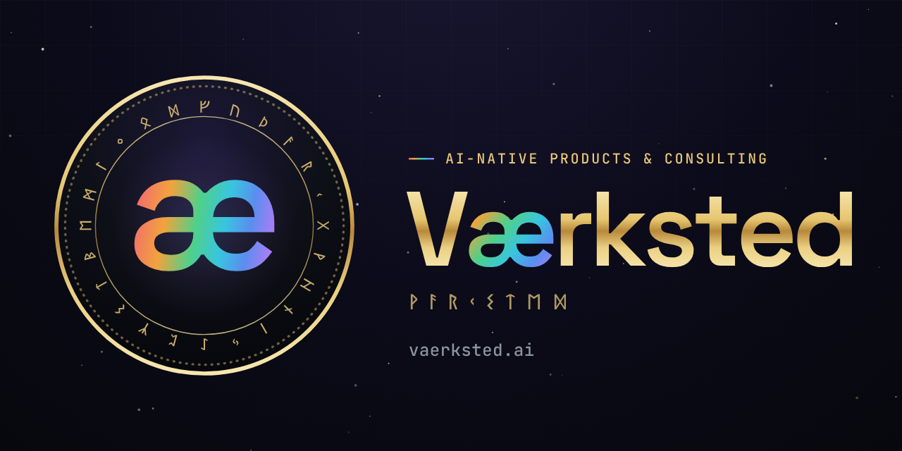
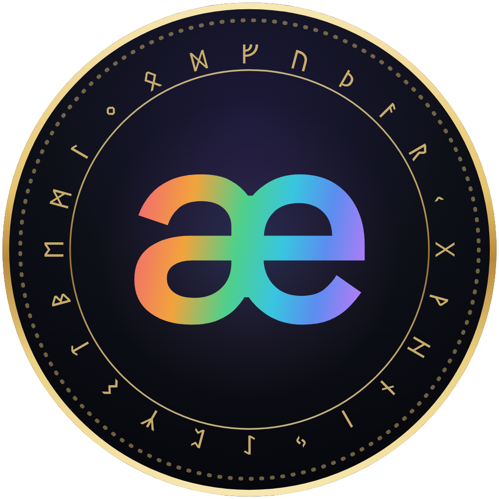
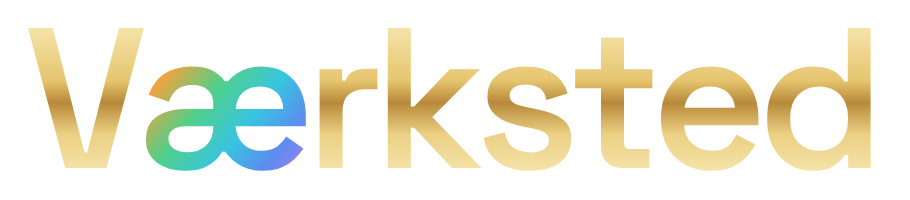
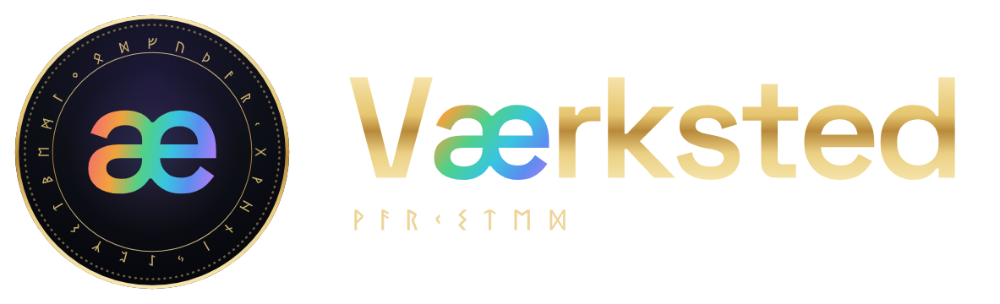
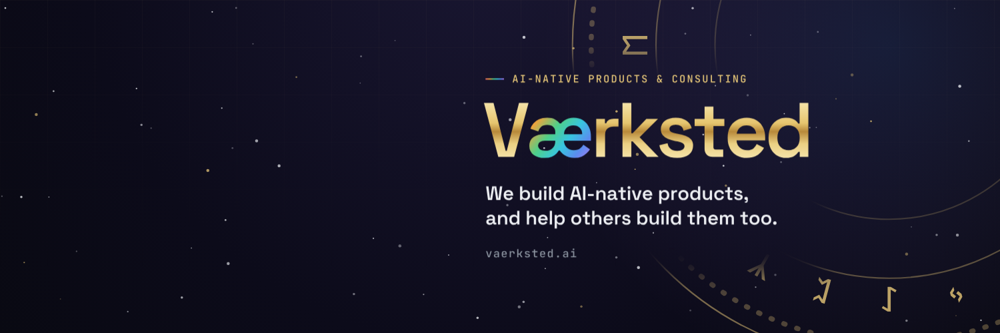
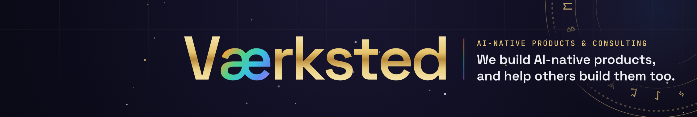
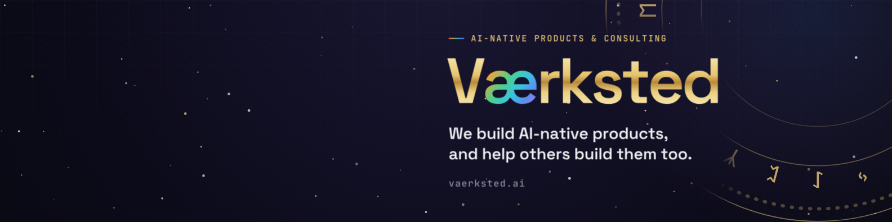
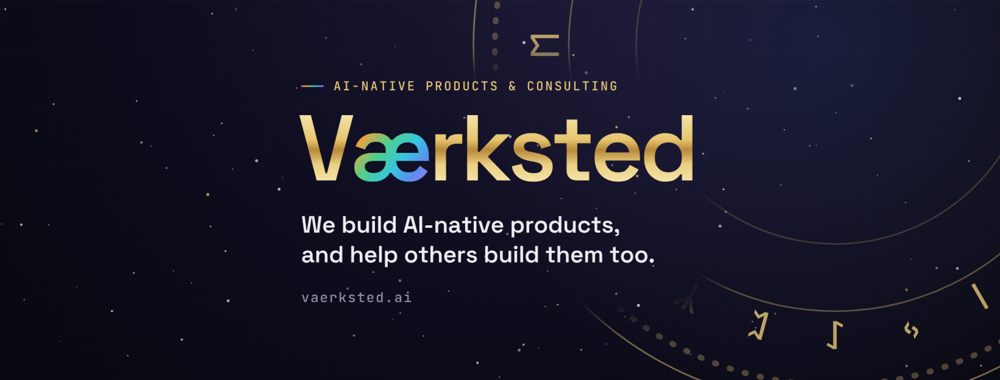
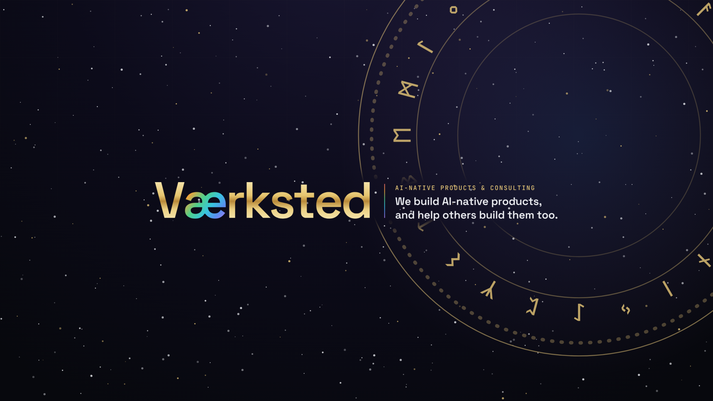

# Værksted brand kit

Logos and social images for vaerksted.ai. Grab the file you need from this folder.

| Preview | File | Use it for |
|---|---|---|
|  | [`logo-avatar.png`](logo-avatar.png) (1024px) · [`500`](logo-avatar-500.png) · [`400`](logo-avatar-400.png) · [`200`](logo-avatar-200.png) · [`svg`](logo-avatar.svg) | Profile picture: GitHub, X, LinkedIn, Slack. Safe for circle and rounded-square crops. |
|  | [`social-preview.png`](social-preview.png) (1280×640) · [`svg`](social-preview.svg) | GitHub repo → Settings → Social preview. Also works as a banner. |
|  | [`logo-seal.png`](logo-seal.png) · [`svg`](logo-seal.svg) | The seal alone, transparent background. |
|  | [`logo-wordmark.png`](logo-wordmark.png) · [`svg`](logo-wordmark.svg) | "Værksted" wordmark, transparent. **Dark backgrounds only.** |
|  | [`logo-lockup.png`](logo-lockup.png) · [`svg`](logo-lockup.svg) | Seal + wordmark + runes, transparent. **Dark backgrounds only.** |

## Account banners (`social/`)

Profile picture everywhere: `logo-avatar.png` (or `-400` where a platform wants 400×400).
The banners keep the text clear of where each platform puts the profile picture and of
the strips it crops on phones.

| Preview | File | Size | Where |
|---|---|---|---|
|  | [`social/x-header.png`](social/x-header.png) | 1500×500 | X / Twitter header. Also Bluesky and Mastodon. |
|  | [`social/linkedin-company-cover.png`](social/linkedin-company-cover.png) | 2256×382 (2× of 1128×191) | LinkedIn company page → Edit page → Cover image. |
|  | [`social/linkedin-personal-cover.png`](social/linkedin-personal-cover.png) | 1584×396 | LinkedIn personal profile background, for team members. |
|  | [`social/facebook-cover.png`](social/facebook-cover.png) | 1640×624 | Facebook page cover. |
|  | [`social/youtube-banner.png`](social/youtube-banner.png) | 2560×1440 | YouTube channel banner (text sits in the area every device shows). |

Instagram, GitHub, Slack and Discord only take a profile picture, so use `logo-avatar.png`.

## Colours

| Token | Hex |
|---|---|
| Void (background) | `#07080D` |
| Panel | `#0E1018` |
| Gold | `#E8C879` (metal gradient `#F7E7B0 → #E6C56F → #B8893A → #EBD083 → #F7E7B0`) |
| Bifröst (the æ) | `#F26D6D → #F2A33C → #4FD08A → #38C5E0 → #5B8DEF → #B07CF6` |

Type: Space Grotesk SemiBold (wordmark), JetBrains Mono (labels), Noto Sans Runic (runes).

## Regenerating

Everything here is produced by [`../render_brand.py`](../render_brand.py). The SVGs have their
text converted to outlines, so they need no fonts installed. See the script's docstring for the
font files it needs.
